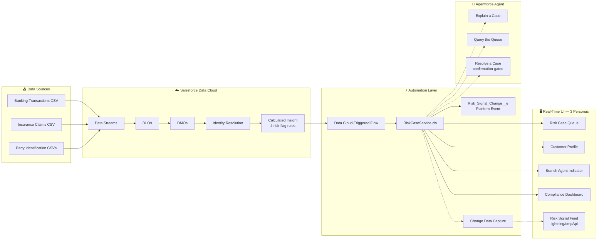
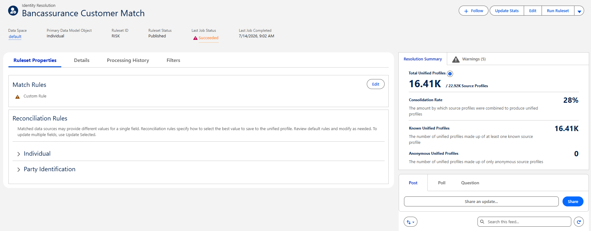
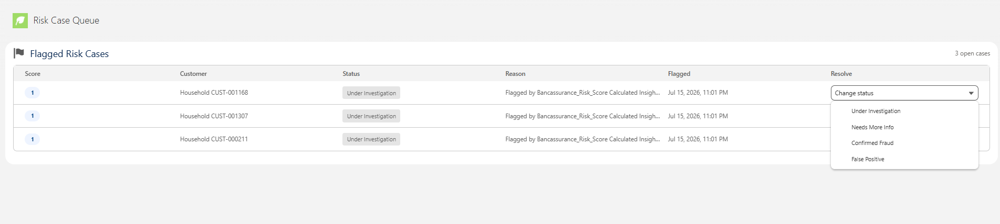
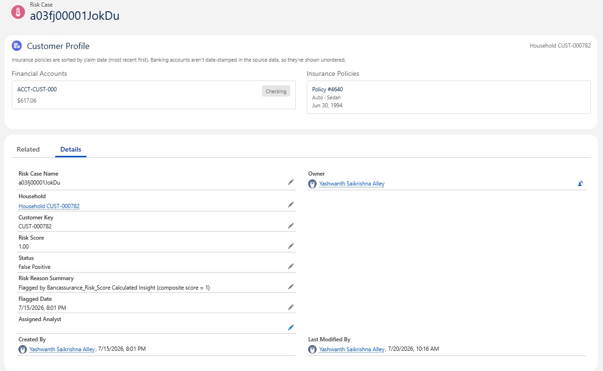
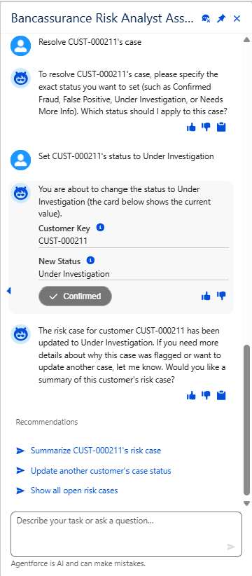
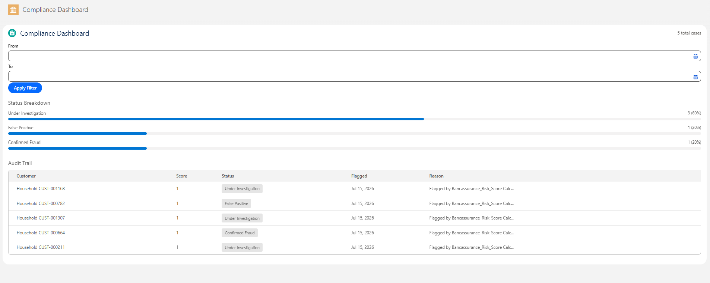
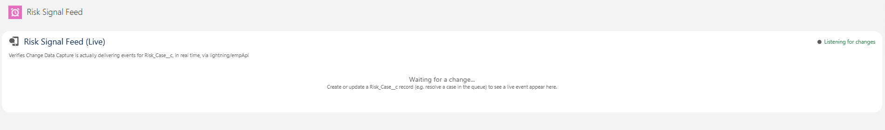

<div align="center">

# 🏦 Bancassurance Risk Platform

**A cross-product fraud/risk detection platform on Salesforce Data Cloud, Apex, LWC, and Agentforce**

Unifying banking and insurance data for a single customer to surface risk signals that neither dataset reveals alone.

[](https://www.salesforce.com/data/)
[](#-testing)
[](#-testing)
[](#-agentforce-agent)
[](#-cicd)
[](#-license)

</div>

---

> [!NOTE]
> This is a portfolio project built to demonstrate real, working Salesforce architecture — not a tutorial walkthrough. Every number, threshold, and finding documented below was derived from actually running the pipeline against real (anonymized, public) data. See [**Known Limitations**](#️-known-limitations) for an equally honest account of what isn't finished.

## 📑 Table of Contents

- [What This Demonstrates](#-what-this-demonstrates)
- [Architecture](#-architecture)
- [Tech Stack](#-tech-stack)
- [Real Engineering Stories](#-real-engineering-stories-worth-reading)
- [Screenshots](#-screenshots)
- [Getting Started](#-getting-started)
- [Testing](#-testing)
- [Adapting This Project to Your Own Dataset](#-adapting-this-project-to-your-own-dataset)
- [Known Limitations](#️-known-limitations)

---

## ✨ What This Demonstrates

<table>
<tr>
<td width="50%" valign="top">

**🔧 Data Cloud Engineering**
Data Streams, DLOs, DMOs, Identity Resolution, Calculated Insights (Visual Builder), real statistical thresholds derived via Query Editor

**⚙️ Apex**
Bulk-safe service classes, Invocable Actions, dependency-injection test seams for external-object dependencies, 100+ tests

**🖥️ Lightning Web Components**
Five components across three personas, real-time CDC subscription via `lightning/empApi`, live-verified against restricted users

</td>
<td width="50%" valign="top">

**🤖 Agentforce**
A genuinely grounded AI agent — every fact it states comes from a custom Apex action, never invented — including a confirmation-gated write action

**🔐 Enterprise Access Architecture**
Three fully separate Lightning Apps, Profiles, and Permission Sets, each verified with an independent, non-impersonated login

**🚀 CI/CD**
Two independent, real pipelines (GitHub Actions + Copado), both enforcing test coverage gates

</td>
</tr>
</table>

---

## 🏗️ Architecture



---

## 🧰 Tech Stack

| Layer | Technology |
|---|---|
| Data ingestion & unification | Salesforce Data Cloud (Data Streams, DLOs, DMOs, Identity Resolution) |
| Business logic | Data Cloud Calculated Insight (Visual Builder), Apex |
| Automation | Data Cloud-Triggered Flow, Platform Events, Change Data Capture |
| UI | Lightning Web Components (LWC), Lightning App Builder |
| AI | Agentforce (custom Invocable Apex Actions as grounding) |
| Access control | Lightning Apps, Profiles, Permission Sets |
| CI/CD | GitHub Actions (JWT auth), Copado |
| Planned | MuleSoft Anypoint (ingestion automation — [status below](#️-known-limitations)) |

---

## 📖 Real Engineering Stories Worth Reading

This project surfaced several genuine, non-trivial problems — documented honestly rather than glossed over. Click any story to expand.

<details>
<summary><strong>🎯 A risk rule with zero real hits</strong></summary>
<br>

Rule 4 (repeat-claims + banking flag) was independently confirmed via raw SQL to occur **0 times** in the actual data — a genuine finding from real data, not a bug. Kept in the model and documented as such, rather than quietly removed to hide an inconvenient result.
</details>

<details>
<summary><strong>🧮 A platform SQL dialect restriction, found mid-build</strong></summary>
<br>

`MAX` couldn't nest inside `CASE` in Data Cloud's Calculated Insight engine ("Aggregation function MAX cannot be nested with CASE function"). Switched to a SUM + post-aggregate cap pattern instead — same logical result, different mechanism.
</details>

<details>
<summary><strong>🪟 A Windows long-path failure</strong></summary>
<br>

DevOps Data Kit's auto-generated field-mapping filenames exceeded Windows' 260-character path limit on first retrieve attempt. Resolved via `git config --global core.longpaths true` (user-level, no admin rights needed).
</details>

<details>
<summary><strong>🔄 A five-attempt debugging journey to a working Data Cloud-Triggered Flow</strong></summary>
<br>

Calculated Insight custom output fields are invisible to a generic Record-Triggered Flow — confirmed across a generic trigger object, Get Records on sync AND async paths, and direct `$Record` access, all dead ends. The fix: a dedicated **"Data Cloud Triggered Flow"** type exposes the real fields directly — not a workaround, the actual correct flow type.
</details>

<details>
<summary><strong>🔑 A real architecture bug: the wrong customer key</strong></summary>
<br>

`Risk_Case__c.Customer_Key__c` was silently populated with a Data Cloud-internal Unified Individual Id instead of the real, raw source key — two genuinely different identifiers. Found while scoping a UI feature, root-caused via the Identity Resolution bridge table, and fixed with a resolver class plus a one-time data-migration script for already-created records.
</details>

<details>
<summary><strong>📉 A genuine Apex coverage crisis (96% → 47%)</strong></summary>
<br>

Adding Data Cloud-integrated classes (which can't be unit-tested the normal way — no seeding external objects in tests) tanked org-wide coverage below Copado's 75% deployment gate. Fixed by separating untestable external-object queries into thin wrapper methods and extracting all real business logic into pure, fully-testable functions — not by lowering the bar or writing shallow tests.
</details>

<details>
<summary><strong>🤖 A three-bug Agentforce debugging saga</strong></summary>
<br>

1. A generic, undiagnosable activation failure with zero detail in the Problems panel or browser console
2. A corrupted action registration that silently refused to save field descriptions — required a full delete-and-rebuild
3. A schema failure specific to returning a nested `List<CustomApexClass>` from an Invocable Action — fixed by flattening to plain primitives

All three found, root-caused, and fixed — including confirming the third one also silently broke Salesforce's own built-in `AnswerQuestionsWithKnowledge` action, proving it was a platform quirk, not project-specific code.
</details>

<details>
<summary><strong>🔐 A documented Salesforce platform requirement, confirmed via Salesforce Help</strong></summary>
<br>

Change Data Capture subscription needs **`View All Records`** on the object — plain `Read` access is not sufficient, even though `Read` is sufficient for normal SOQL. Diagnosed by temporarily instrumenting the LWC's error handler to reveal the real CometD rejection (`403: User not allowed to subscribe CDC without required permissions`), since the default error surfaced was generic and unhelpful.
</details>

<details>
<summary><strong>🎫 A license-type discovery</strong></summary>
<br>

A read-only persona (Compliance Officer) is better served by a **`Salesforce Platform`** license than a full `Salesforce` license — discovered while working around an exhausted Developer Edition license pool, but genuinely the more architecturally correct choice for a custom-object-only, read-only role, not just a workaround.
</details>

> [!TIP]
> Full technical detail on all of these — including the exact debugging steps, error messages, and code — is in the project's internal Build Guide.

---

---

## 📸 Screenshots

<table>
<tr>
<td width="50%" colspan="2">

**Identity Resolution — 16,410 Unified Profiles**
Real Identity Resolution output: 16,410 unified customer profiles matched from 22,920 source records across banking and insurance — the foundation everything downstream is built on.



</td>
</tr>
<tr>
<td width="50%">

**Risk Case Queue**
Prioritized, color-coded severity badges — the automation pipeline's output, ready for an analyst to act on.



</td>
<td width="50%">

**Customer Profile**
Unified banking + insurance view on a single Risk Case — real account balance, real policy detail, real claim date.



</td>
</tr>
<tr>
<td width="50%">

**Agentforce Agent — Live Answer**
A real, unedited conversation — every fact grounded in actual data, nothing invented.



</td>
<td width="50%">

**Compliance Dashboard**
Real status breakdown and audit trail — the reporting layer, working against live data.



</td>
</tr>
<tr>
<td width="50%" colspan="2">

**Risk Signal Feed — Live CDC Event**
The moment a real `UPDATE` event lands, proving Change Data Capture delivery end to end, not just configured and assumed.



</td>
</tr>
</table>

---

## 🚀 Getting Started

### Prerequisites
- Salesforce Developer Edition org with Data Cloud (Data 360) enabled
- Salesforce CLI (`sf`)
- Node.js (for the CI/CD tooling)
- Git

### Setup

```bash
git clone https://github.com/saikrishnaalley/bancassurance-risk-platform.git
cd bancassurance-risk-platform
sf org login web --alias riskorg
sf project deploy start --source-dir force-app
```

> [!WARNING]
> Data Cloud components (Calculated Insight, Data Cloud-Triggered Flow, Agentforce agent metadata) are excluded from automated deploy via `.forceignore`, since these are UI-managed, already-active components that can't be redeployed via a generic Metadata API push once live. See the Build Guide for the manual setup steps for these pieces.

---

## 🧪 Testing

```bash
sf apex run test --test-level RunLocalTests --code-coverage --result-format human --wait 20
```

<div align="center">

| Metric | Result |
|---|---|
| Tests | **100+** |
| Pass Rate | **100%** |
| Org-Wide Coverage | **88%+** |

</div>

---

## 🔄 Adapting This Project to Your Own Dataset

This project is built around two specific real, anonymized public datasets (Kaggle Credit Card Fraud Detection and Vehicle Insurance Claims Fraud Detection). If you want to fork this repo and adapt it to your own data, here's an honest breakdown of what's reusable as-is versus what you'll need to rebuild.

### Reusable as-is

These pieces are dataset-agnostic and will work unchanged regardless of what data you bring:

- **Custom objects** — `Household__c`, `Financial_Account__c`, `Insurance_Policy__c`, `Risk_Case__c`
- **`RiskCaseService.cls`** — the Apex service that upserts a `Risk_Case__c` and publishes a `Risk_Signal_Change__e` event. It only expects a customer key, a numeric score, and an optional reason string — it has no knowledge of what generated the score.
- **`Risk_Signal_Change__e`** Platform Event
- **GitHub Actions CI/CD workflow** (`.github/workflows/deploy.yml`) — just needs your own org's JWT credentials wired up as repo secrets (`SF_CONSUMER_KEY`, `SF_JWT_KEY`, `SF_USERNAME`, `SF_INSTANCE_URL`)
- **The overall architecture pattern**: Data Streams → DLOs → DMOs → Identity Resolution → Calculated Insight → Apex service → Platform Event → CDC

### Needs rework — this is dataset-specific

Be upfront with yourself that this is the real work, not a find-and-replace exercise:

1. **Your own source files.** Obviously, you'll bring your own CSVs (or connect a live source).
2. **Data Stream field mappings.** The mappings from source columns to DMO fields are tied to this project's exact column names (`Amount`, `Days_Policy_Claim`, `AddressChange_Claim`, etc.). You'll remap every field to whatever your dataset actually has.
3. **DMO structure.** `Banking_Transaction_DMO` and `Insurance_Claim_DMO` reflect this project's specific schemas. Expect to redesign your DMOs around your own data's shape.
4. **A shared join key across your data sources.** This project uses an injected synthetic `Customer_Key__c` to link banking and insurance records for the same fictional customer, since the two source datasets don't share a natural key. If your real data already has a genuine shared identifier (a real customer ID, SSN, email, etc.), you likely don't need this workaround — use Identity Resolution's native matching instead. If it doesn't, you'll need an equivalent preprocessing step to establish one.
5. **The four risk-flag rules themselves.** This is the part most likely to be underestimated. The rules in this project (`Amount ≥ 1065.67`, `PastNumberOfClaims = 'more than 4'`, etc.) are semantically specific to fraud patterns in banking + auto insurance. If your domain is different (e.g., healthcare claims, retail returns fraud, loan default risk), you need to design new rules from scratch based on what risk actually looks like in your data — not just relabel these ones.
6. **The actual threshold values.** Even if your domain is conceptually similar (e.g., also banking + insurance fraud), don't reuse these specific numbers. They were derived by running real percentile and frequency queries (via Data Cloud's Query Editor) against this project's specific ingested data — see the Build Guide for the exact queries used. Re-run that same calibration process against your own data; don't assume these numbers transfer.

### Suggested order of operations for a fork

1. Set up your own Salesforce Developer Edition org and Data Cloud instance.
2. Ingest your own data as Data Streams, and map to your own DMOs.
3. Set up Identity Resolution using whichever join key strategy fits your data (native match or a synthetic key, per point 4 above).
4. Verify unification worked (check unified profile counts, spot-check a few records) before building anything downstream.
5. Design your own risk-flag rules based on what your data and domain actually indicate as risk — don't skip straight to copying this project's Calculated Insight logic.
6. Calibrate real thresholds against your own data using percentile/frequency queries, the same way this project did.
7. Build the Calculated Insight in Visual Builder using your new rules and thresholds.
8. Deploy the reusable pieces (custom objects, `RiskCaseService.cls`, the Platform Event, the CI/CD workflow) largely as-is, adjusting only field-level references if your object model differs.

### What doesn't transfer at all

Don't reuse the raw thresholds, the specific rule logic, or the DMO field mappings verbatim — these are load-bearing for *this* dataset's actual statistical distribution and domain meaning. Treating them as universal constants would produce a Calculated Insight that looks like it works but isn't grounded in your actual data.

---

## ⚠️ Known Limitations

Documented honestly, not hidden:

- **Banking-side chronology**: `Financial_Account__c` records are intentionally not date-ordered. The source dataset's only time field is seconds-elapsed-since-first-transaction, not a real calendar timestamp — adding a fabricated date would misrepresent the data. The insurance side genuinely *is* chronologically ordered, using a real date derived from the source data's month/week/year fields.
- **Product-line reporting**: not built. Every `Risk_Case__c` in this platform is inherently cross-product by design — each of the four risk rules requires both a banking AND an insurance signal to fire — so a single-value "product line" field would carry no real reporting signal.
- **CDC event history**: the live Risk Signal Feed component intentionally does not persist history across a page refresh — it's a real-time proof-of-delivery tool, not an audit log (that role belongs to the Compliance Dashboard, which does persist real data).

<details>
<summary><strong>🔌 MuleSoft status — genuine partial progress</strong></summary>
<br>

Anypoint Platform trial signed up, Anypoint Studio installed, a Mule project created with the Salesforce Data Cloud Connector added, and a Connected App built with **working, tested OAuth Client Credentials authentication**. A Bulk Ingestion flow was started (Scheduler configured) but not finished before development moved to other priorities. See the Build Guide for the exact resume point if this is picked back up.
</details>

---

## 📄 License

This is a personal portfolio project. Feel free to fork and adapt — see [Adapting This Project to Your Own Dataset](#-adapting-this-project-to-your-own-dataset) above for an honest breakdown of what transfers and what doesn't.

<div align="center">

---

Built by [Sai Krishna Alley](https://github.com/saikrishnaalley) as a demonstration of production-grade Salesforce architecture.

</div>